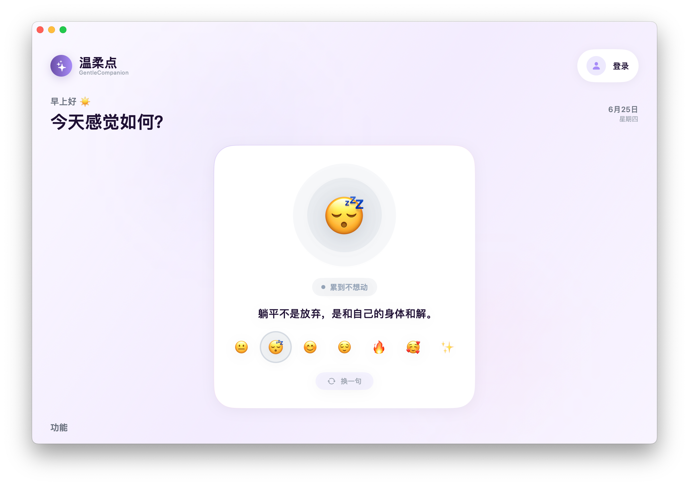
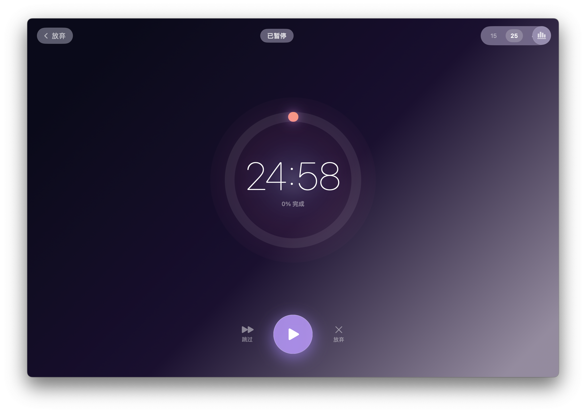
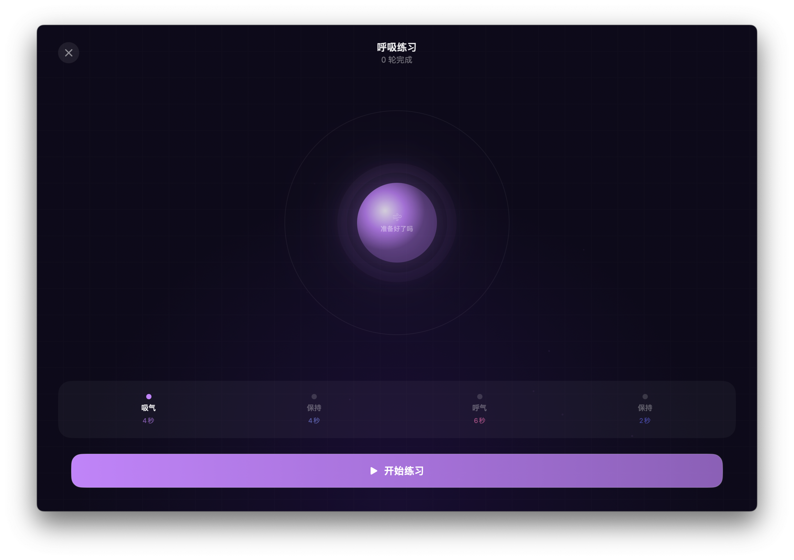
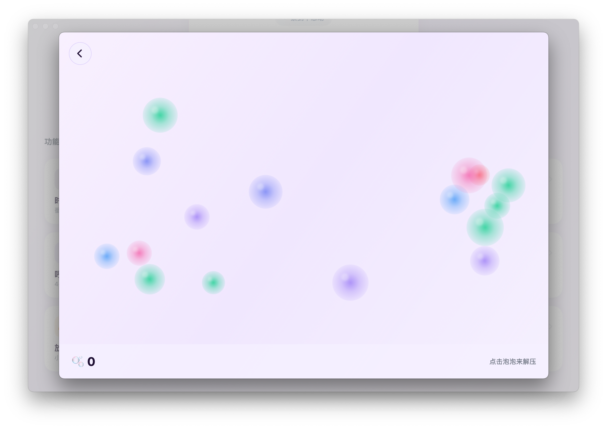
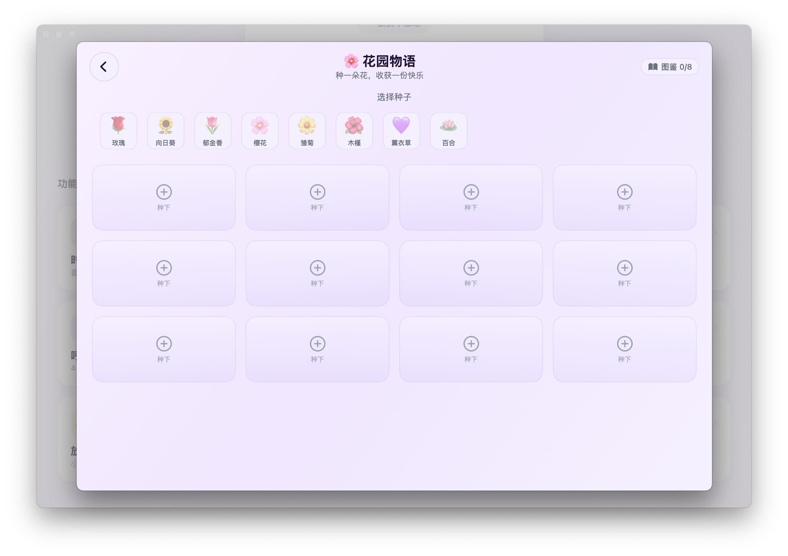
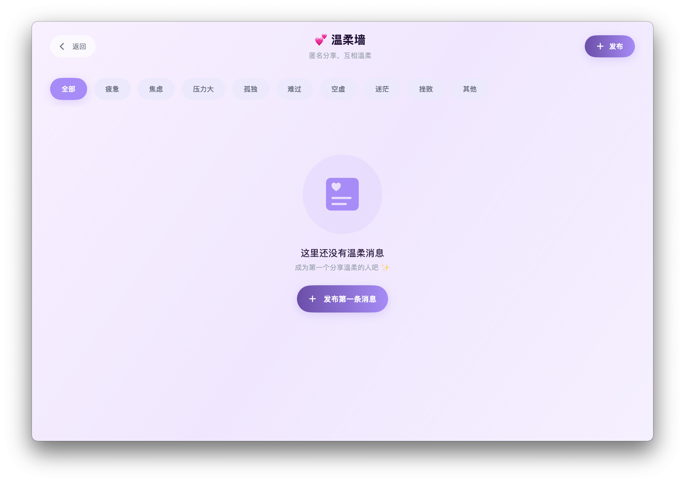

# GentleCompanion · 温柔点

> A gentle mental wellness companion for modern city dwellers.  
> 为都市人打造的 macOS 心理健康陪伴应用——用温柔的话语、舒缓的界面、实用的工具，帮你缓解压力、找回内心的节奏。

<p align="center">
  
  
  
  
  
</p>

## 📸 应用截图

<p align="center">
  <em>（请替换为你的实际截图）</em>
  <br>
  <sub>建议录制 GIF：主界面 | 番茄钟动效 | 呼吸粒子动画 | 温柔墙</sub>
</p>

| 情绪陪伴 | 番茄钟 | 呼吸练习 |
|:---:|:---:|:---:|
|  |  |  |
| **泡泡解压** | **花园物语** | **温柔墙** |
|  |  |  |

---

## 功能特性

### 情绪陪伴
- **7 种情绪识别**：丧/空、疲惫、焦虑、孤独、复杂开心、压抑愤怒、其他
- 每种情绪配有 8+ 条温柔治愈文案（共 50+ 条）
- 情绪历史追踪，回顾心情变化轨迹

### 番茄钟
- 25 分钟标准专注计时
- 4 种状态：准备 → 专注中 → 暂停 → 休息
- Liquid Glass 毛玻璃风格面板
- 专注意图设置，完成后的番茄钟分享

### 呼吸练习
- **4-4-6-2 呼吸法**：吸气 4s → 屏息 4s → 呼气 6s → 屏息 2s
- 暗色氛围背景 + 粒子动画引导

### 小游戏
- **泡泡解压 (BubblePop)**：点击泡泡释放压力，连击系统
- **花园物语 (Garden)**：12 格花园养成，8 种花卉图鉴
- **律动圆环 (Rhythm)**：节奏踩点游戏，combo 连击

### 温柔墙
- 匿名发布心情消息
- 9 种情绪标签筛选和点赞

### 社交网络
- 发布动态、图片附件、公开/私密帖子
- 关注/取关用户、好友请求系统
- 一对一私信对话
- 排行榜（连续天数 / 番茄钟数 / 分钟数）

### 账号系统
- 本地账号注册/登录（PBKDF2-SHA256）
- Apple 登录、游客模式
- 个人资料管理（性别、生日、兴趣标签）

### 其他
- 天气集成（WeatherKit），智能提醒
- 沉浸全屏/浮动窗口模式
- 空闲时间自动触发陪伴

---

## 技术架构

```
GentleCompanion/
├── GentleCompanionApp.swift       # @main 入口
├── ContentView.swift              # 主内容入口
├── Design.swift                   # 集中式设计系统 (Token)
├── Package.swift                  # SPM 包定义
├── Models/                        # 数据层
│   ├── Emotion.swift              # 情绪模型 + 文案
│   ├── AccountManager.swift       # 本地账号系统
│   ├── AppMode.swift              # 三模式系统
│   ├── NetworkService.swift       # HTTP 客户端
│   ├── SocialService.swift        # 社交服务
│   └── ...
├── Views/                         # UI 层 (SwiftUI)
│   ├── GentleMainView.swift       # 主页面
│   ├── PomodoroView.swift         # 番茄钟
│   ├── BreathingView.swift        # 呼吸引导
│   ├── SocialFeedView.swift       # 社交动态
│   ├── GentleWallView.swift       # 温柔墙
│   ├── AuthView.swift             # 登录/注册
│   ├── SettingsView.swift         # 设置
│   ├── BubblePopGame.swift        # 泡泡解压
│   ├── GardenGame.swift           # 花园物语
│   ├── RhythmGame.swift           # 律动圆环
│   └── ...
├── backend/
│   ├── main.py                    # FastAPI Python 后端
│   └── requirements.txt
└── Assets.xcassets/               # 资源文件
```

### 技术栈

| 层级 | 技术 |
|------|------|
| **UI** | SwiftUI + AppKit |
| **设计** | 集中式 Design Token 系统 |
| **状态管理** | Combine (@StateObject, @ObservedObject) |
| **网络** | async/await + URLSession |
| **认证** | CryptoKit + CommonCrypto (PBKDF2) |
| **Apple 服务** | AuthenticationServices, WeatherKit, CoreLocation, UserNotifications |
| **后端** | FastAPI (Python 3.11+) + PHP 7.4+ |
| **数据库** | 内存数据库 (开发) / MySQL (生产) |
| **部署** | Docker + Nginx 反向代理 |

### 设计系统

所有颜色、字体、间距、圆角、阴影通过 `Design.swift` 集中管理，支持 macOS / Windows 双平台主题自动检测。

---

## 快速开始

### 前置要求

- **macOS 14.0+**
- **Xcode 16+**
- **Swift 6.0**

### 构建运行

```bash
# 克隆仓库
git clone https://github.com/TaYYQ/GentleCompanion.git
cd GentleCompanion

# 在 Xcode 中打开项目
open GentleCompanion/

# 使用 SPM 构建
cd GentleCompanion
swift build

# 或直接运行
swift run
```

### 后端部署

详见下方 [部署指南](#部署指南)。

---

## API 接口

所有 API 位于 `/api/` 路径下：

| 分类 | 端点 | 说明 |
|------|------|------|
| **Auth** | `POST /api/auth/register` | 注册 |
| | `POST /api/auth/login` | 登录 |
| **User** | `GET /api/user/profile` | 获取个人资料 |
| | `PUT /api/user/profile` | 更新个人资料 |
| **Social** | `GET /api/social/feed` | 动态列表 |
| | `POST /api/social/posts` | 发布动态 |
| | `POST /api/social/posts/{id}/like` | 点赞 |
| | `POST /api/social/share-pomodoro` | 番茄钟分享 |
| **Follow** | `POST /api/social/follow/{userId}` | 关注用户 |
| | `POST /api/social/unfollow/{userId}` | 取关 |
| | `GET /api/social/followers` | 粉丝列表 |
| | `GET /api/social/following` | 关注列表 |
| **Friends** | `GET /api/social/friends` | 好友列表 |
| | `POST /api/social/friend-requests` | 发送好友请求 |
| | `POST /api/social/friend-requests/{id}/respond` | 处理好友请求 |
| **Messages** | `GET /api/social/conversations` | 会话列表 |
| | `POST /api/social/messages` | 发送消息 |
| **Leaderboard** | `GET /api/social/leaderboard` | 排行榜 |

---

## 部署指南

### 使用 Docker

```bash
cd GentleCompanion
docker compose up -d --build
```

服务架构：
```
nginx (:80) → /api/* → FastAPI (:8000)
            → *.php  → PHP-FPM (:9000) → MySQL (:3306)
```

### 手动部署（宝塔面板）

1. 将 `backend/main.py` 上传至你的服务器
2. 安装 Python 3.11+ 及依赖：`pip install fastapi uvicorn pydantic`
3. 启动服务：`nohup python3 main.py &`
4. 配置 Nginx 反向代理 `127.0.0.1:8000`

---

## 项目计划

- [x] 情绪陪伴系统
- [x] 番茄钟专注
- [x] 呼吸练习
- [x] 小游戏
- [x] 温柔墙
- [x] 社交网络
- [x] 账号系统
- [x] 天气集成
- [ ] macOS 与 iOS 跨平台
- [ ] 数据持久化（SQLite / CoreData）
- [ ] 单元测试覆盖
- [ ] CI/CD 自动构建

---

## 贡献指南

欢迎提交 Issue 和 Pull Request！

1. Fork 本仓库
2. 创建特性分支：`git checkout -b feat/amazing-feature`
3. 提交更改：`git commit -m 'feat: add amazing feature'`
4. 推送分支：`git push origin feat/amazing-feature`
5. 发起 Pull Request

---

## 开源协议

本项目采用 [MIT License](LICENSE) 开源。
